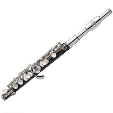

# 제목1
## 제목2
### 제목3

- 순서가 없는 리스트
  - 순서가 없는 리스트

1. 순서가
1. 있는
1. 리스트  

```python
print('hello world')
```

오늘 파이썬을 배웠는데 
`print`라고 하는 것을 배웠다.

[Google로 이동](http://www.google.com)




**굵게**
*기울임*
~~취소선~~
---

> 인용문
> ```python
>print ('hello')
>```